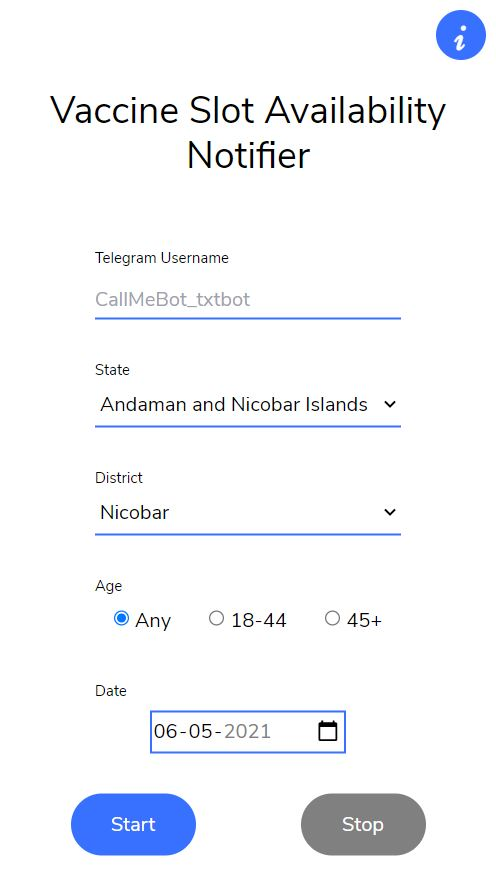
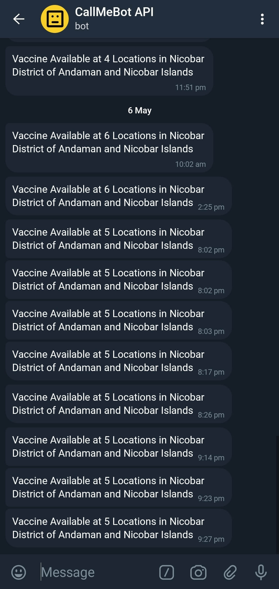

# Vaccine-Slot-Availability-Notifier

- This Web App continuosuly checks for a vaccine slot in a particular district, and if any slot is available it will send Telegram message to the given Telegram ID.
- Web App makes use of the Cowin Web API to fetch slot availability, for more info <b>[click here](https://apisetu.gov.in/public/marketplace/api/cowin)</b>

## How to Use the App

- To receive Telegram message, you first need to authorize with CallMeBot_txtbot bot, only then you will receive messaages. To authorize with the bot <b>[go here](https://t.me/CallMeBot_txtbot)</b>. This bot is not owned by me and for more information about the bot, <b>[visit here](https://www.callmebot.com/)</b>
- After successfull authorization with the bot you can start using the website, either from [here](https://aswinkr77.github.io/Vaccine-Slot-Availability-Notifier/) or locally by downloading it. Just clone or download the package. For mobile users running locally will gonna be a headache, so for you a mobile optimised html file is there called mobile_index.html, use it.

## This is an experimental project
You may experience bugs or errors when running the app and feel free to contact me or create a PR

## Screenshots
     
